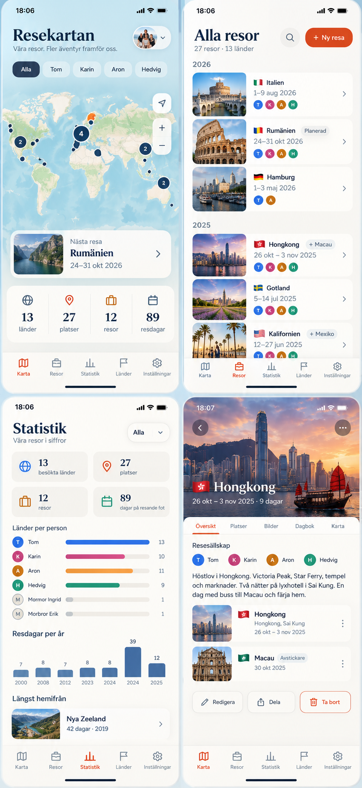

# Inspo: fotobaserad design (2026-09-17)

Mockup som Tom tog fram (annan AI), sparad som `fotobaserad-2026-09-17.png`.
**Inget är byggt.** Ligger här som riktning för framtida utveckling; designspåret
är ännu inte valt (se `../oppna-fragor.md`, Design).

## Vad Tom gillar

- **Foton bär appen.** Varje resa har en thumbnail i listorna (Alla resor, Nästa resa,
  Längst hemifrån) och en stor hero-bild överst i resedetaljen med titel och datum
  ovanpå.
- Ljus, luftig ton med serif-rubriker (Resekartan, Alla resor, Statistik) och de
  fyra personchipsen direkt under rubriken i kartvyn.
- Kluster-pluppar på kartan med antal (4, 2, 2) i stället för en plupp per resa.
- Resedetaljen med flikar: Översikt · Platser · Bilder · Dagbok · Karta.

## Konsekvenser om vi går den vägen

- **Första bilden i varje resa blir thumbnail.** Kräver att bildernas ordning går att
  ändra – drag and drop i bildgalleriet (mobil: långtryck + dra).
- Resor utan bild behöver en snygg fallback (flagga på färgplatta, eller kartutsnitt).
- Bilderna ligger i IndexedDB/Firestore-subcollection per resa i dag; thumbnails
  bör sparas i en egen liten storlek så listorna inte laddar fullstora bilder.
- "Dagbok" och "Dela" finns inte i appen och är inte beställda – bara med i mockupen.
